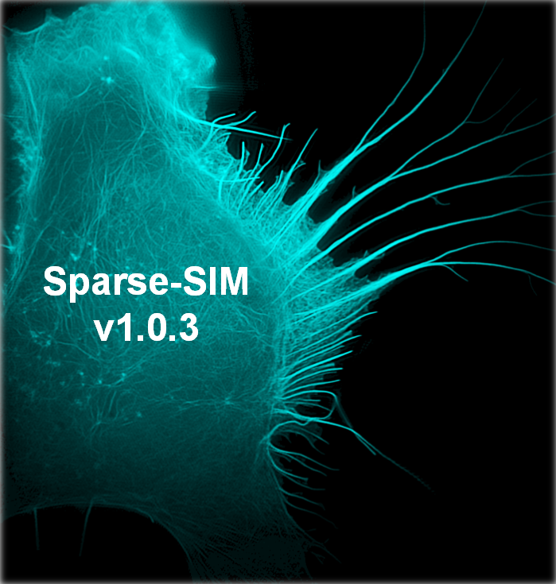
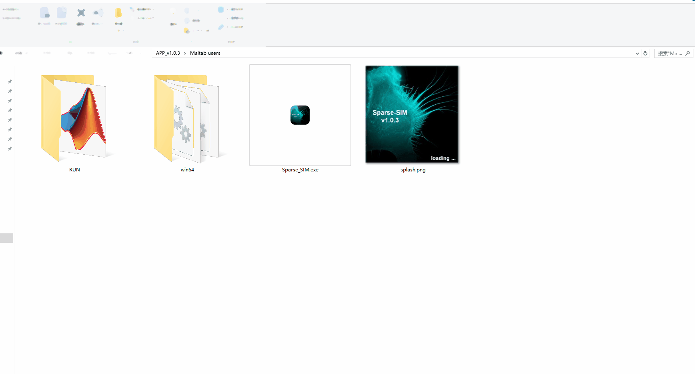

# Sparse-SIM

<p align='left'>
    <a href="https://weisongzhao.github.io/Sparse-SIM/"> </a>
    <a href="https://github.com/WeisongZhao/Sparse-SIM/"> </a>
     <a href="https://www.nature.com"> </a>
 </p>

<p>

</p>


<p align='center'>
  <b> <a href="https://www.nature.com/">Extending resolution of structured illumination microscopy with sparse deconvolution</a></b>
</p>

<p align='center'>
  <b><a href="https://weisongzhao.github.io/">Weisong Zhao</a><sup>1,3</sup>, Shiqun Zhao <sup>2,3</sup>, Liuju Li <sup>2,3</sup>,
<a href="http://homepage.hit.edu.cn/lihaoyu">Haoyu Li</a><sup>1,*</sup></b>
<b><a href="http://www.imm.pku.edu.cn/kytd/rcdw/24147.htm">Liangyi Chen</a><sup>2,*</sup></b>
</p>

<p align='center'>
<sup>1</sup> <a href="http://ise.hit.edu.cn/"> School of Instrumentation Science and Engineering, Harbin Institute of Technology, Harbin 150080</a>, China. 
</p> 

<p align='center'>
<sup>2</sup> <a href="http://www.biomembrane.tsinghua.edu.cn/zh/">State Key Laboratory of Membrane Biology, Beijing Key Laboratory of Cardiometabolic Molecular Medicine, Institute of Molecular Medicine, Peking University, Beijing 100871</a>, China
</p>

<p align='center'>
<sup>3</sup>Equally contributed.
</p>

> This repo. contains the update version of this software (Sparse-SIM reconstruction).
> 
<p align='center'>
    
</p>

## Installation
- The binary executable files (.exe/.app) can be found in the [release](https://github.com/WeisongZhao/Sparse-SIM/releases)
- /src_unix is the source code for Unix-like systems (including MacOS).
- /src_win is the source code for Windows systems.
- Clone/download, and run the `Install.m`
- Please try help `xxx` to get the API.
```python
help SparseHessian_core
help background_estimation
help Fourier_Oversample
```

- Details in the [Document](UserManual.pdf) 

## Parameters: [Wiki](https://github.com/WeisongZhao/Sparse-SIM/wiki/) and [Document](UserManual.pdf) 

### Main parameters

| **Parameter**              | **Description**  | **Situations** | **Recommended** |
| :--------:                   | :-----:           |:----:          | :----:          |
| **Pixel size (nm)**  | For iterative deblur|   ----         |Fit your system|
| **Wave length (nm)**  | For iterative deblur|   ----         |Fit your system|
| **Numerical aperture**  | For iterativedeblur|   ----         |Fit your system, and algorithm para.|
| **Sparse iteration times**  | Sparsity recon. iteration times|Over-sampling (Spatial on/ off)|300/100|
| **Image fidelity**  | Data fidelity |Over-sampling (Spatial on/off)|low/high|
| **t(z)axial continuity**  |Data continuity in t or z |-----|0~1|
| **Sparsity**  |Data sparsity|Artifacts little/much|low/high|
| **Iterative deblur times**  |  The iteration times of deblur|-----|5-15(LR)/30-50(LW)|

### Options:
- 3D imaging: The input images are whether or not 3D images.
- GAIN: the brightness of the image can be altered via this control bar.
- Background: The background estimation level chosen by user. 
- Iterative deblur: The deconvolution method chosen by user.
- Over-sampling: The over-sampling method chosen by user. 

## Version
- v1.0.3 Another type deconvolution, and over-sampling methods, first officially released version!
- v0.6.3 Reorder the background estimation
- v0.6.2 Debug mode
- v0.6.1 Progress bar feature and logo
- v0.5.1 Over-sampling feature and change input file type from `.mat` to `.tif`
- v0.4.1 Background estimation feature
- v0.3.0 Algorithm UI
- v0.2.0 Iterative deblur feature
- v0.1.0 Sparsity reconstruction core


# License 
This software and corresponding methods can only be used for **non-commercial** use, and they are under GNU General Public License as 
published by the Free Software Foundation, version 3 of the license.
 
<p align='center'>
  
  
</p>

